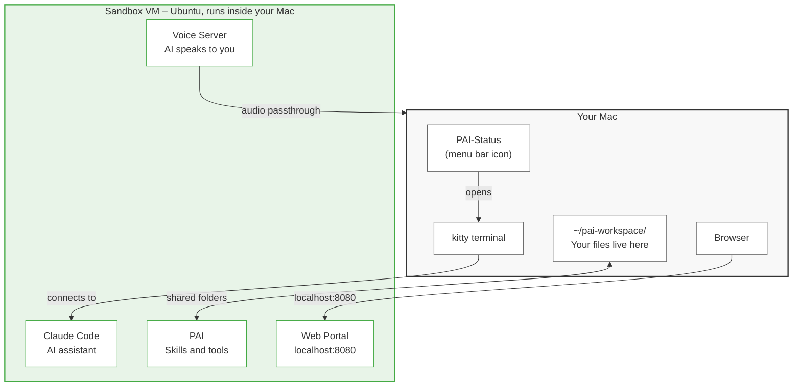

# pai-lima

A sandboxed AI workspace running Claude Code on your Mac. One script to install, a menu bar app to control it.

## How It Works



**The key idea:** Your AI runs in a sandbox (a mini Linux computer inside your Mac). Your files stay on your Mac in `~/pai-workspace/`. The AI can read and write to those files, but it can't touch anything else on your Mac.

## What You Need

- A Mac with Apple Silicon (M1, M2, M3, or M4)
- macOS 13 (Ventura) or later
- An [Anthropic account](https://console.anthropic.com/) (free to create)
- About 10 minutes for the first install

## Quick Start

### Step 1: Install

Open Terminal (it's in Applications > Utilities) and paste these three lines:

```bash
git clone https://github.com/jaredstanko/pai-lima.git
cd pai-lima
./install.sh
```

The installer will download and set up everything automatically. You'll see a lot of output scrolling by -- **ignore it all** until you see the final instructions.

### Step 2: Enable Launch at Login

When the install finishes, look at the **top-right of your screen** for the PAI-Status icon (a small computer icon with a colored dot).

Click it, then click **Launch at Login**. This makes it start automatically when you open your Mac.

### Step 3: Open a PAI Session

Click the PAI-Status icon again, then click **New PAI Session**. A terminal window will open.

### Step 4: Sign In

Claude Code will ask you to sign in. It opens a browser -- log in with your Anthropic account.

When it asks "Do you trust /home/claude/.claude?" say **yes**.

### Step 5: Set Up the Web Portal

Once you're signed in, paste this message into the terminal:

```
Install PAI Companion following ~/pai-companion/companion/INSTALL.md.
Skip Docker (use Bun directly for the portal) and skip the voice
module. Keep ~/.vm-ip set to localhost and VM_IP=localhost in .env.
After installation, verify the portal is running at localhost:8080
and verify the voice server can successfully generate and play audio
end-to-end (not just that the process is listening). Fix any
macOS-specific binaries (like afplay) that won't work on Linux.
Set both to start on boot.
```

Claude Code will ask: **"Do you want to create PRD.md?"** -- press **2** (Yes) to allow it to edit settings for this session.

Wait for it to finish. This takes a few minutes.

### Step 6: You're Done

Open http://localhost:8080 in your browser to see the web portal. From now on, just click **New PAI Session** in the menu bar whenever you want to talk to your AI.

---

## What You Get

- **Sandboxed AI** -- Claude Code runs inside an isolated VM, not directly on your Mac
- **Menu bar control** -- start sessions, stop the VM, open the web portal from one icon
- **Session resume** -- pick up previous conversations where you left off
- **Web portal** -- a local website for viewing AI-created content and exchanging files
- **Shared folders** -- `~/pai-workspace/` on your Mac is shared with the AI
- **Audio** -- the AI can speak through your Mac speakers

## The Menu Bar App

After install, PAI-Status lives in your menu bar (top right). It looks like a small computer icon with a colored dot (green = running, red = stopped).

```
PAI-Status menu:
  VM: Running
  Start VM / Stop VM
  ──────────────────
  New PAI Session       <- opens a new AI workspace
  Active Sessions
    Resume Session      <- pick up where you left off
  ──────────────────
  Open PAI Web          <- opens the web portal
  Open a Terminal       <- plain shell (no AI)
  ──────────────────
  Launch at Login
  Quit PAI-Status
```

## Shared Files

Your Mac and the AI share files through `~/pai-workspace/`:

```
~/pai-workspace/
  exchange/    Drop files here -- the AI can read them
  work/        AI outputs and projects
  data/        Datasets and databases
  portal/      Web portal content
  claude-home/ AI settings, memory, sessions
  upstream/    Reference repos
```

Your data lives on your Mac. You can destroy and recreate the VM without losing anything.

### Sharing Additional Folders

The quickest way to get files into the VM is the `exchange/` folder — just drop files there.

To give the AI permanent access to a project folder on your Mac:

```bash
./scripts/mount.sh ~/Projects/my-repo
```

This stops the VM briefly (~10 seconds), adds the mount, and restarts. Your directory then appears at `/home/claude/my-repo` inside the VM with live two-way sync.

```bash
./scripts/mount.sh --list                                # See what's shared
./scripts/mount.sh ~/Projects/my-repo /home/claude/code  # Choose where it appears in the VM
```

### Syncing a Directory for One Session

If you want to work on a project without adding a permanent mount, use Lima's `--sync` flag. It copies the directory into the VM when you open the shell and copies any changes back when you exit:

```bash
# Sync ~/Projects/my-repo into the VM for this session
limactl shell --sync ~/Projects/my-repo pai

# The AI can work on the files inside the VM.
# When you exit the shell, changes sync back to your Mac.
```

This is useful for one-off tasks — no VM restart needed, and your files stay safe because the AI works on a copy inside the VM, not the originals. Changes only come back when the session ends cleanly.

### Copying Files Without Mounting

To copy individual files in or out without mounting or syncing:

```bash
# Copy a file from your Mac into the VM
limactl cp ./myfile.txt pai:/home/claude/exchange/myfile.txt

# Copy a file from the VM to your Mac
limactl cp pai:/home/claude/work/output.pdf ./output.pdf

# Copy an entire folder (use -r)
limactl cp -r ./my-project pai:/home/claude/exchange/my-project
```

This works while the VM is running — no restart needed.

---

## Advanced

Everything below is for power users who want to customize or troubleshoot.

### Install Options

```bash
./install.sh                        # Normal install
./install.sh --verbose              # Show detailed output
./install.sh --name=v2              # Parallel install as a separate instance
./install.sh --name=v2 --port=8082  # Parallel install with specific portal port
```

### Parallel Installs

Use `--name` to run multiple instances side by side. Each gets its own VM, workspace, menu bar app, and portal port:

```bash
./install.sh --name=v2

# Creates:
#   VM:        pai-v2
#   Workspace: ~/pai-workspace-v2/
#   App:       PAI-Status-v2.app
#   Portal:    http://localhost:8081 (auto-assigned)
```

All scripts accept `--name` to target a specific instance:

```bash
./scripts/launch.sh --name=v2
./scripts/verify.sh --name=v2
./scripts/upgrade.sh --name=v2
./scripts/uninstall.sh --name=v2
```

### CLI Fallback

If you prefer the terminal over the menu bar:

```bash
./scripts/launch.sh              # New PAI session
./scripts/launch.sh --resume     # Resume a previous session
./scripts/launch.sh --shell      # Plain shell in the VM
```

### Verification

```bash
./scripts/verify.sh              # Check system health (PASS/FAIL for each component)
```

### Upgrading

```bash
cd pai-lima
git pull
./scripts/upgrade.sh
```

Your workspace, authentication, and sessions are preserved.

### Backup & Restore

```bash
./scripts/backup-restore.sh backup     # Back up VM + workspace
./scripts/backup-restore.sh restore    # Restore from a backup
```

### Uninstall

```bash
./scripts/uninstall.sh
```

Removes the VM, menu bar app, and launch agents. Asks before deleting workspace data.

### VM Specs

| Setting | Default |
|---------|---------|
| VM engine | VZ (Apple Virtualization.framework) |
| OS | Ubuntu 24.04 ARM64 |
| CPUs | 4 |
| Memory | 4 GB |
| Disk | 50 GB |
| Audio | VirtIO sound device |

To resize:

```bash
limactl stop pai
limactl edit pai --cpus 6 --memory 6
limactl start pai
```

### Troubleshooting

**Install fails at "Creating sandbox VM"** -- Run `limactl delete pai --force` then `./install.sh` again.

**PAI-Status not in menu bar** -- Run `open /Applications/PAI-Status.app`.

**No audio** -- Open a terminal in the VM and run `sudo modprobe virtio_snd`.

**Web portal not loading** -- Make sure the VM is running (green dot in menu bar), then try http://localhost:8080.

## Credits

- [Lima](https://lima-vm.io/) -- Linux VMs on macOS
- [PAI](https://github.com/danielmiessler/Personal_AI_Infrastructure) -- Personal AI Infrastructure by Daniel Miessler
- [PAI Companion](https://github.com/chriscantey/pai-companion) -- Companion package by Chris Cantey
- [kitty](https://sw.kovidgoyal.net/kitty/) -- GPU-accelerated terminal emulator
